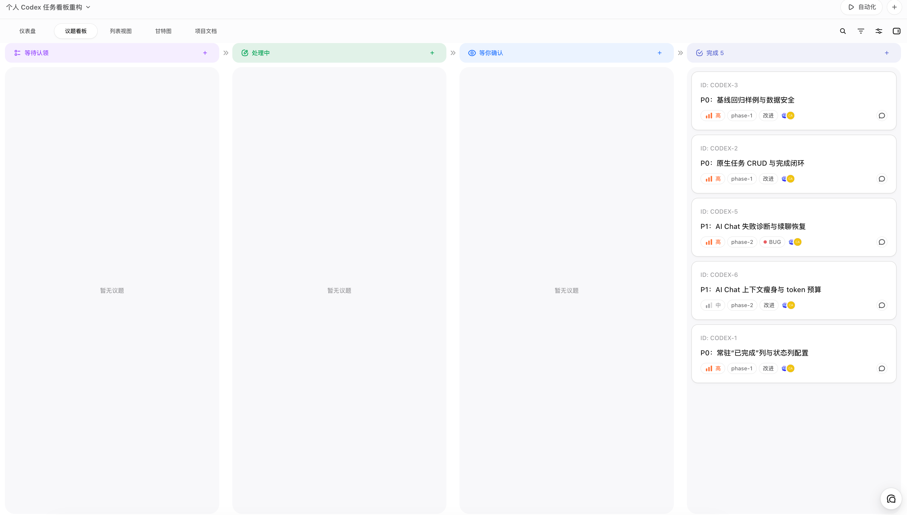

# Agent Taskboard

Agent Taskboard is a local-first taskboard and CLI for coding-agent workflows. It organizes projects, tasks, comments, relations, automations, and agent conversations from a desktop app or `taskctl`.



It integrates with OpenAI Codex and other coding-agent workflows, but is an independent community project—not made by, affiliated with, sponsored by, or endorsed by OpenAI.

## Highlights

- Local-first SQLite data with optional self-hosted Cloudflare collaboration.
- Desktop launcher and platform packaging source for future distribution.
- `taskctl` CLI for agents and scripts, preserving existing Taskboard skill command compatibility.
- Markdown descriptions, labels, priorities, relations, comments, due dates, automations, and AI context.
- Agent guidance in [`docs/agent-workflows.md`](docs/agent-workflows.md) and [`llms.txt`](llms.txt).

## Install

v2.0.0 is a source-only release. GitHub automatically provides the tagged source ZIP and tarball; this project does not currently publish Windows, macOS, or Linux installers. Clone the repository and follow the development quick start below, or build a desktop package locally using the platform requirements in [`docs/release.md`](docs/release.md). Installer publishing will be enabled separately after signing, packaging, and support gates are established.

Existing users should read the [v2 migration note](docs/release.md#v2-migration). The new app uses `Agent Taskboard` data and log directories; migration is manual and does not delete the previous directory.

## Quick start

```sh
npm install
npm run dev
npm run taskctl -- project list
npm run taskctl -- issue list --status todo
ln -s "$PWD/skills/manage-taskboard" "$HOME/.agents/skills/manage-taskboard"
```

## Support scope

| Surface | Status | Notes |
| --- | --- | --- |
| Source release | Available | GitHub-generated ZIP and tarball for v2.0.0 |
| OpenAI Codex | Compatible | Requires the user's own Codex installation/account |
| Self-hosted Cloudflare | Optional | See [`docs/cloud-collaboration.md`](docs/cloud-collaboration.md) |
| Desktop installers | Not published | Packaging is source-only until a future release gate is approved |

## Privacy and security

Data is local by default. Agent Taskboard has no advertising or telemetry. Optional cloud mode sends data only to the deployment you configure. Codex and other providers remain subject to their own terms. See [`PRIVACY.md`](PRIVACY.md) and [`SECURITY.md`](SECURITY.md).

## Documentation

- [Architecture](docs/architecture.md)
- [Agent workflows](docs/agent-workflows.md)
- [Release and v2 migration](docs/release.md)
- [Contributing](CONTRIBUTING.md)
- [Support](SUPPORT.md)
- [Roadmap](ROADMAP.md)

## Development

Requirements: Node.js 22.5+ and Rust 1.88+ for desktop builds.

```sh
npm ci
npm run typecheck
npm run build:web
node --test
```

The project uses Apache-2.0. It is an independently maintained derivative of an Apache-2.0 taskboard baseline; see [`NOTICE`](NOTICE). The project does not send changes back to the former upstream repository.

## Contributions and license

Please read [`CONTRIBUTING.md`](CONTRIBUTING.md), [`CODE_OF_CONDUCT.md`](CODE_OF_CONDUCT.md), and [`SECURITY.md`](SECURITY.md). Suggested GitHub topics: `taskboard`, `coding-agents`, `ai-agents`, `codex`, `taskctl`, `local-first`, `developer-tools`.

Copyright © 2026 STFQ and contributors. Licensed under [Apache License 2.0](LICENSE).
